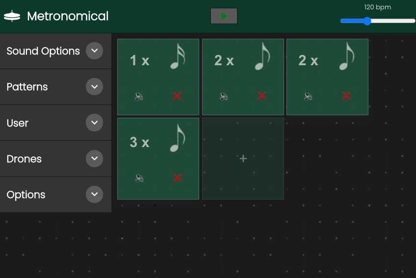

# Metronomical - Programmable Metronome
The aim of this metronome is to encourage exploration of odd meters and irregular patterns. By removing any refence to a consistant grid of bars/measures and instead relying on simple rythmic blocks, it is possible to discover new rhythmic possibilities. 

This project is still in developmentand was built with ToneJs, Javascript, CSS, HTML, React, Styled Components, Strapi, Netlify, Heroku

## Current Issues
- Rework the stepData context, stepEngine class back into EngineContext
- Sounds won't update if they are changed when the metronome is playing
- Same as above but for mutes
- Theme Colours need to be finished
- Resize the UI, it's a little small
- Style the pattern blocks more
- Currently active step not showing anymore

## Feature Progress (Nov 2021)
- ✅ Responsive
- ✅ Another user programmable sound for when the sequence restarts
- ✅ User Login to save, delete patterns and related data from backend
- ✅ Additional drone player with all 12 keys
- ✅ Added the ability to completely mute any of the sounds
- ✅ Added theming
- ✅ Simplified Pattern input interface, works better for touch
- ❌ Midi Output to trigger other software/hardware
- ❌ 32nd Notes, dotted notes, maybe tuplets
- ❌ Possibility to add a second sequencer for overlapping polyrhythmic stuff
- ❌ Volume controls for each individual sound
- ❌ User Registration

[comment]: <> (## Requirements)

[comment]: <> (## Usage)

## License
MIT